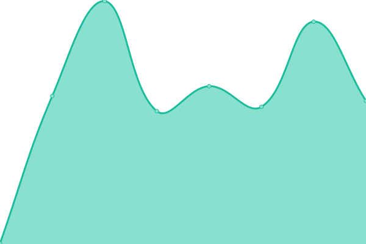
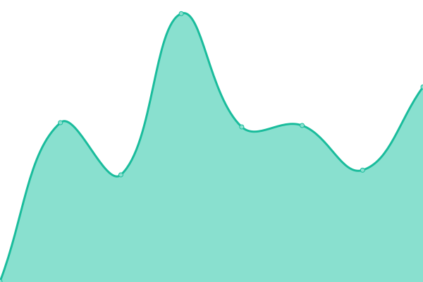

# [📈 Live Status](https://upptime.github.io/upptime): <!--live status--> **🟩 All systems operational**

This repository contains the open-source uptime monitor and status page for [Upptime](https://upptime.js.org), powered by [Upptime](https://github.com/upptime/upptime).

With [Upptime](https://upptime.js.org), you can get your own unlimited and free uptime monitor and status page, powered entirely by a GitHub repository. We use [Issues](https://github.com/upptime/upptime/issues) as incident reports, [Actions](https://github.com/FhenixPRotocol/fhenix-status/actions) as uptime monitors, and [Pages](https://upptime.github.io/upptime) for the status page.

<!--start: status pages-->
<!-- This summary is generated by Upptime (https://github.com/upptime/upptime) -->
<!-- Do not edit this manually, your changes will be overwritten -->
<!-- prettier-ignore -->
| URL | Status | History | Response Time | Uptime |
| --- | ------ | ------- | ------------- | ------ |
|  Testnet API Endpoint | 🟩 Up | [testnet-api-endpoint.yml](https://github.com/FhenixProtocol/fhenix-status/commits/HEAD/history/testnet-api-endpoint.yml) | 

 2714ms
     
 | 

<a href="https://status.fhenix.zone/history/testnet-api-endpoint">84.17%</a>
    

|  [Fhenix Explorer](https://explorer.helium.fhenix.zone/api/v2/config/backend-version) | 🟩 Up | [fhenix-explorer.yml](https://github.com/FhenixProtocol/fhenix-status/commits/HEAD/history/fhenix-explorer.yml) | 

 326ms
     
 | 

<a href="https://status.fhenix.zone/history/fhenix-explorer">100.00%</a>
    

|  [Fhenix Docs](https://docs.fhenix.zone) | 🟩 Up | [fhenix-docs.yml](https://github.com/FhenixProtocol/fhenix-status/commits/HEAD/history/fhenix-docs.yml) | 

 613ms
     
 | 

<a href="https://status.fhenix.zone/history/fhenix-docs">100.00%</a>
    

|  [Faucet](https://get-helium.fhenix.zone) | 🟩 Up | [faucet.yml](https://github.com/FhenixProtocol/fhenix-status/commits/HEAD/history/faucet.yml) | 

 410ms
     
 | 

<a href="https://status.fhenix.zone/history/faucet">100.00%</a>
    

|  [Landing Page](https://www.fhenix.io) | 🟩 Up | [landing-page.yml](https://github.com/FhenixProtocol/fhenix-status/commits/HEAD/history/landing-page.yml) | 

 343ms
     
 | 

<a href="https://status.fhenix.zone/history/landing-page">100.00%</a>
    

<!--end: status pages-->

[**Visit our status website →**](https://upptime.github.io/upptime)

## 📄 License

- Powered by: [Upptime](https://github.com/upptime/upptime)
- Code: [MIT](./LICENSE) © [Anand Chowdhary](https://anandchowdhary.com), supported by [Pabio](https://pabio.com)
- Data in the `./history` directory: [Open Database License](https://opendatacommons.org/licenses/odbl/1-0/)
